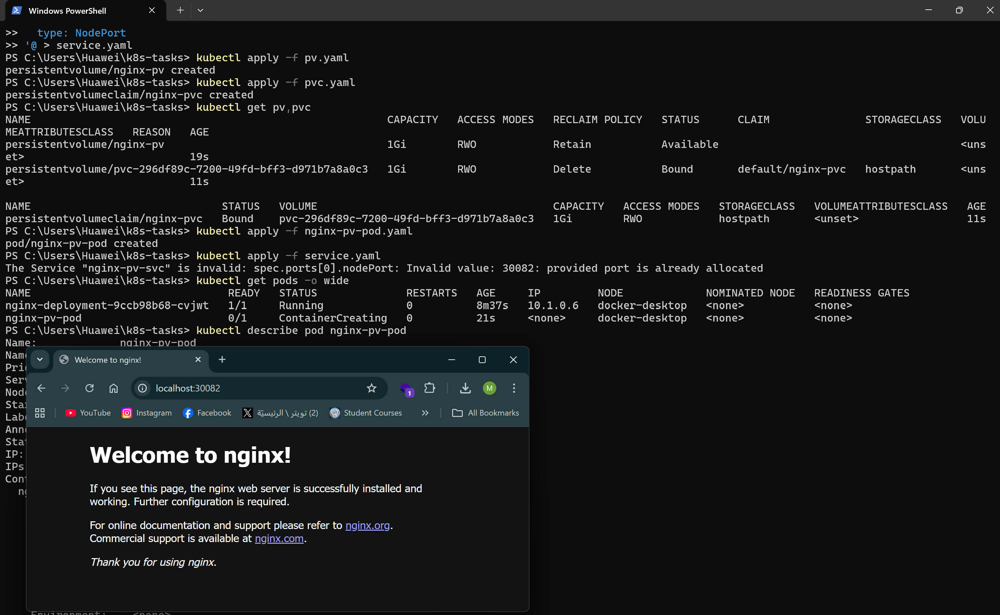

\# Task 1: Nginx Pod with ConfigMap, PV, PVC, and ClusterIP Service

\*\*Description:\*\*  

\- Create a Pod running Nginx.  

\- Use a ConfigMap to change the default Nginx port from 80 to 82.  

\- Use PersistentVolume (PV) and PersistentVolumeClaim (PVC) to map a custom `index.html` from the cluster host to the container.  

\- Expose the Pod using a ClusterIP Service.  

\- Test access by using `curl` inside another Nginx pod using both Pod IP and ClusterIP.

\*\*Files:\*\*  

\- task1.yaml  

\- configmap.yaml  

\- pv.yaml  

\- pvc.yaml  

\- service.yaml  

\*\*Resources:\*\*  

\- Pod, ConfigMap, PV, PVC, and ClusterIP Service created successfully.

