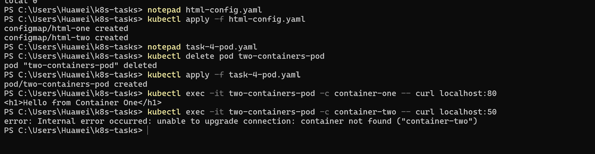

\# Task 4: Two Containers in a Single Pod

\*\*Description:\*\*  

\- Create a Pod with two containers:  

&nbsp; 1. Container one listens on port 80.  

&nbsp; 2. Container two uses a ConfigMap to change port to 50.  

\- Map separate `index.html` files for each container.  

\- Expose the Pod via a Service.  

\- Test access using `curl` from another Pod to each container.

\*\*Files:\*\*  

\- task-4-pod.yaml  

\- task-4-svc.yaml  

\- configmap-50.yaml  

\*\*Resources:\*\*  

\- Two-container Pod and Service created successfully.  

\- Both containers serve custom HTML as expected.

