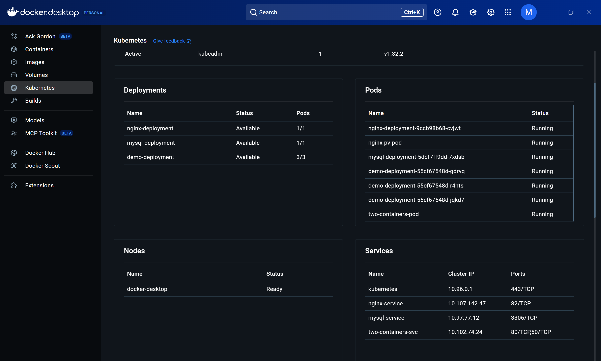

\# Task 5: Namespace Quota and Deployment Limitation

\*\*Description:\*\*  

\- Create a namespace named `depi`.  

\- Limit the namespace to \*\*1 Pod\*\* and \*\*1 Deployment\*\* using a ResourceQuota.  

\- Attempt to create a Deployment with 3 replicas and observe the behavior (quota restrictions).  

\- Show `kubectl get pods -n depi` output to demonstrate the effect.

\*\*Files:\*\*  

\- depi-quota.yaml  

\- depi-deploy.yaml  

\*\*Resources:\*\*  

\- Namespace `depi` created.  

\- ResourceQuota applied.  

\- Deployment behavior validated according to quota limits.

